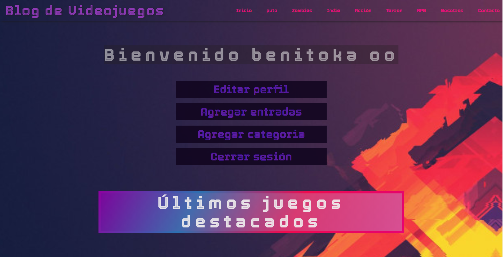
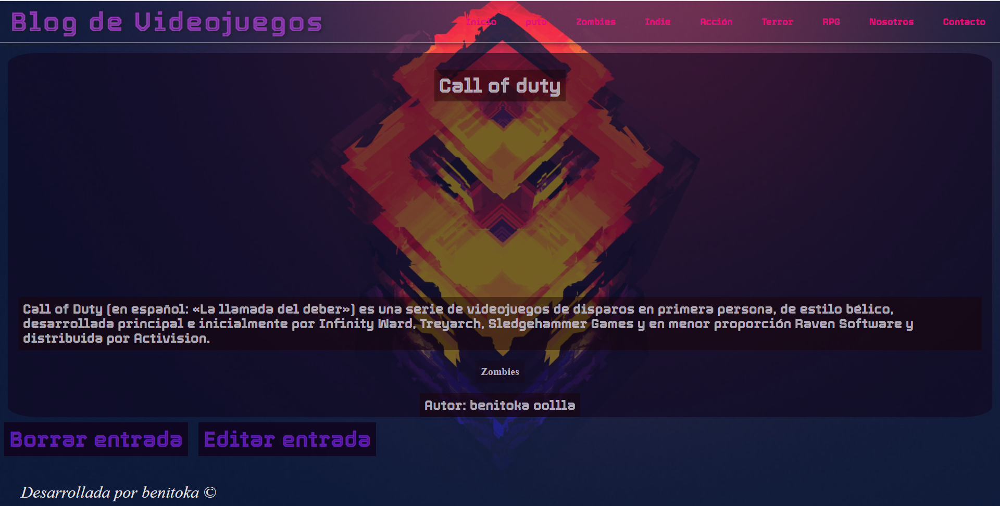

# Proyecto sitio web blog de videojuegos.
  ## Breve descripción:
  El proyecto está bastante funcional gracias a funciones pequeñas tales como tocar los nombres y redirigir a una vista SOLA de esa página, tocar categorias y se genera una vista solamente de las categorias, etc. También cuenta con el registro de cuentas conectado a la base datos. 
  ## Trabajo con base de datos
  Aquí encontramos un CRUD. Creamos usuarios, categorías, contenido de las anteriores, podemos borrarlas, editarlas. 
  Hay bastantes comprobaciones, solo el usuario registrado puede editar sus propias entradas!!!.

  ## Cosas a mejorar
    Aún le falta obviamente, proximamente tendrá javascript y optaré por cargar imagenes dinamicamente. El wampserver tiene varios errores respecto al caché no sé por qué!!. Luego la memoria explota.

  ## Fotos del sitio web funcional
      ***Aclaración: recordar que github no ejecuta el backend!***

